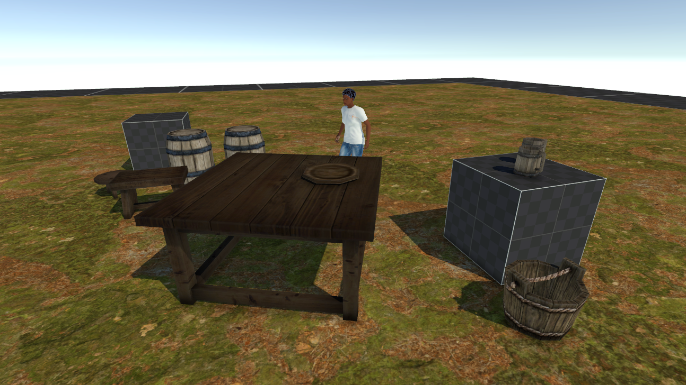
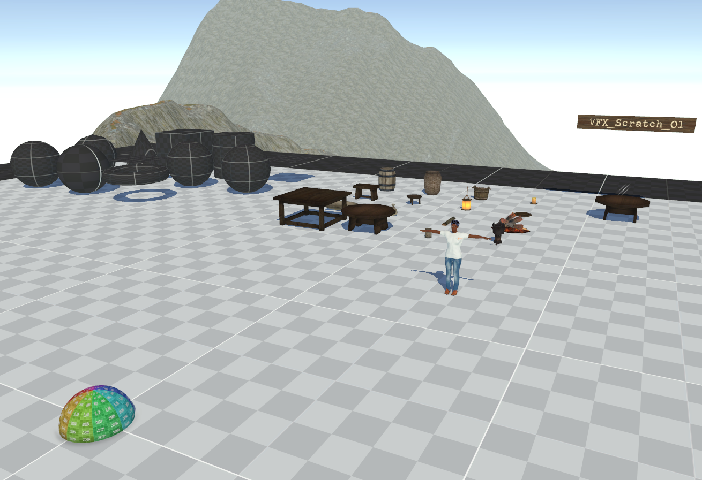
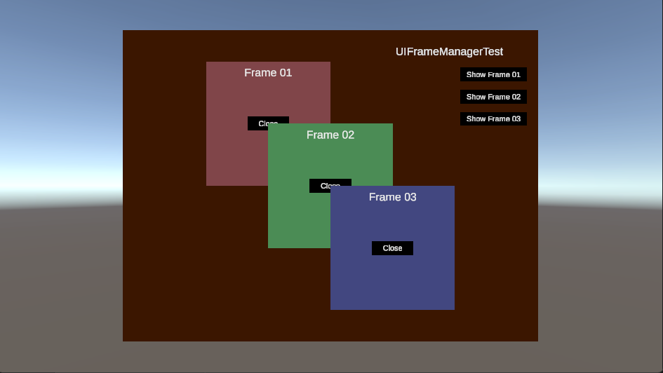

# Standard Assets for Unity

## Introduction

These are standard assets that I include in most of my projects. Though this package was put together with a third person RPG in mind, it could be helpful for other genres as well.

### Required Dependency

### Optional Dependencies

These are proprietary assets that I currently use. Many users do not like proprietary assets, so I have included instruction here on how to remove these dependencies. However, by default, this StandardAssets package assumes these dependencies have already been included.

#### MicroSplat

Direcory StandardAssets/Art/MicroSplat includes a Texture Array Configuration and material for MicroSplat, though you will need to acquire the MicroSplat shader file from the Unity Asset Store.

If you do not want to use this dependency, simply delete the MicroSplat folder, then update the demo terrain's material with your favorite terrain shader.

- MicroSplat [link](https://assetstore.unity.com/packages/tools/terrain/microsplat-96478)
- MicroSplat URP 2022 [link](https://assetstore.unity.com/packages/tools/terrain/microsplat-urp-2022-support-244845)

## Scenes

### Demo

There's not much to the demo scene, yet. This may be removed.

### Layout

An overview of included art.

### Frame Manager

There is a demo scene included, along with a test script, for the included frame manager.

## License

Fonts are included that were licensed with the Open Font License and Apache License respectively. Please see Art/Font for the necessary licenses.

All other contents in this package fall under the MIT license (with some content originally from the public domain). This license was chosen so that you can grab what you need with the least amount of hassle possible.